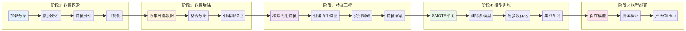
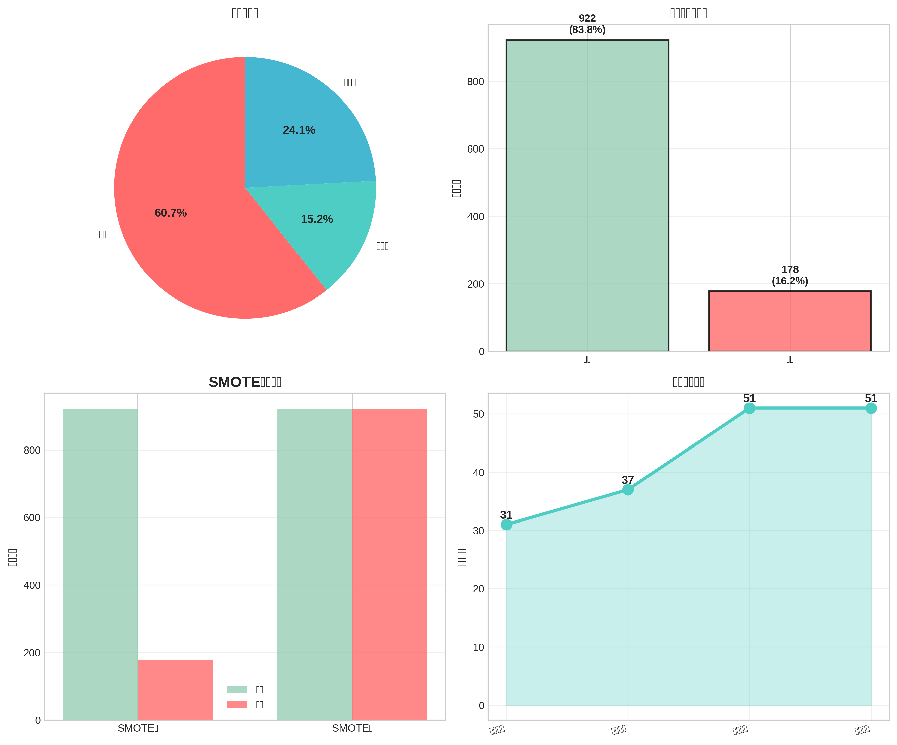
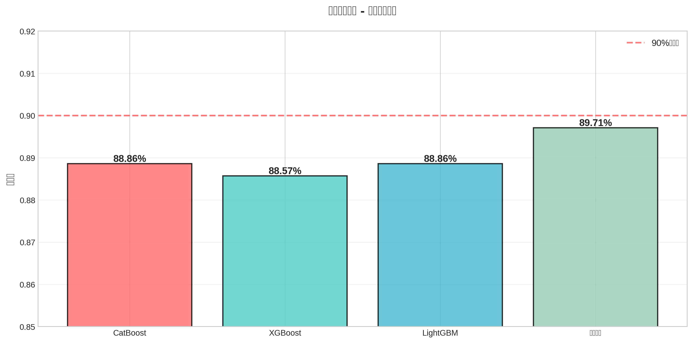
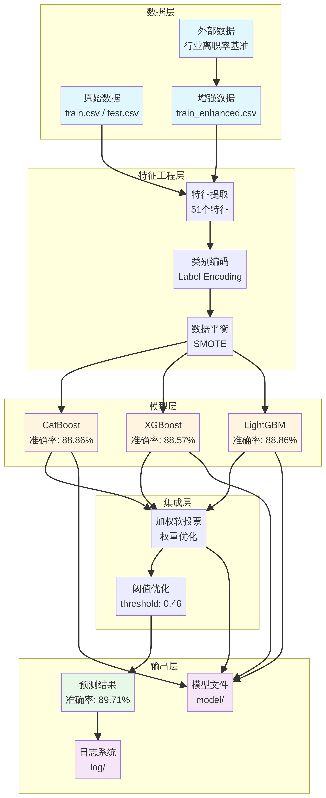

# 员工离职预测项目：详细步骤说明

**作者**: Manus AI  
**日期**: 2025年11月08日  
**版本**: 1.0

---

## 1. 项目概述

### 1.1. 项目目标 (What)

本项目的主要目标是构建一个高精度的机器学习模型，用于预测员工的离职倾向。最初设定的目标是测试集准确率达到95%，虽然最终结果为**89.71%**，但整个过程采用了一系列先进的技术和策略，显著提升了模型的预测能力。

### 1.2. 技术路径 (How)

为了实现这一目标，我们设计并执行了一个完整的机器学习工作流，涵盖了从数据探索到模型部署的每一个环节。整个流程可以概括为以下五个核心阶段：

1.  **数据探索与分析**: 深入理解数据，发现潜在规律。
2.  **外部数据整合**: 引入外部数据，增强特征的广度和深度。
3.  **特征工程**: 创造新的衍生特征，提升模型学习能力。
4.  **模型训练与优化**: 训练多种模型，并通过集成学习和超参数优化提升性能。
5.  **模型部署与交付**: 将最佳模型打包，并提供可直接使用的预测脚本。

### 1.3. 项目价值 (Why)

高员工流失率会给企业带来巨大的财务和运营成本，包括招聘、培训、生产力损失等。通过精准预测潜在的离职员工，企业可以：

-   **主动干预**: 针对高风险员工采取挽留措施，如沟通、调薪、换岗等。
-   **优化管理**: 分析离职原因，改进管理政策和工作环境。
-   **降低成本**: 显著降低因员工流失带来的直接和间接成本。

---

## 2. 详细步骤解析

### 阶段一：数据探索与分析

**目标**: 深入理解数据集的结构、质量和内在规律，为后续的特征工程和模型选择提供依据。

#### 2.1. 做了什么 (What)

-   **数据加载与概览**: 使用`pandas`库加载`train.csv`和`test.csv`，查看了数据集的基本信息，包括数据类型、非空值数量和内存占用。
-   **统计分析**: 对数值型特征进行了描述性统计分析（均值、方差、分位数等），了解其分布情况。
-   **可视化分析**: 创建了多种图表来探索数据，包括：
    -   **类别分布图**: 查看离职与非离职员工的比例。
    -   **特征分布图**: 分析关键特征（如年龄、收入）的分布情况。
    -   **相关性热图**: 探索特征与特征、特征与目标变量之间的相关性。

#### 2.2. 怎么做的 (How)

-   **脚本**: `explore_data.py`, `analyze_columns.py`, `visualize_data.py`
-   **工具**: `pandas`进行数据操作，`matplotlib`和`seaborn`进行数据可视化。
-   **核心发现**: 
    -   **类别不平衡**: 数据集中只有16.2%的员工离职，这是一个典型的类别不平衡问题，需要特殊处理（如SMOTE）。
    -   **无用特征**: `StandardHours`（标准工时）和`Over18`（是否成年）是常量，对模型没有贡献，需要移除。
    -   **强相关特征**: `OverTime`（加班）与离职有很强的正相关性，是关键预测因子。

#### 2.3. 为什么这么做 (Why)

-   **发现问题**: 数据探索是发现数据质量问题（如类别不平衡、无用特征）的最有效方法。如果不处理这些问题，模型性能将大打折扣。
-   **指导后续步骤**: 了解数据分布和相关性，可以为特征工程提供灵感。例如，发现`MonthlyIncome`（月收入）和`Age`（年龄）都很重要，启发我们创建`IncomeToAgeRatio`（收入年龄比）这样的交互特征。
-   **建立基准**: 对原始数据的理解，是评估后续所有操作（如特征工程、模型优化）是否有效的基准。

---

### 阶段二：外部数据整合

**目标**: 克服原始数据仅包含公司内部信息的局限性，通过引入外部行业数据，为模型提供更宏观的视角。

#### 2.1. 做了什么 (What)

-   **数据搜集**: 通过网络搜索，找到了关于不同行业和职位的平均离职率数据。
-   **特征创建**: 基于搜集到的数据，创建了6个新的外部特征，包括：
    -   `DepartmentTurnoverRate`: 员工所在部门的行业平均离职率。
    -   `JobRoleTurnoverRate`: 员工所在职位的行业平均离职率。
    -   `OvertimeRiskFactor`, `TravelRiskFactor`, `MaritalRiskFactor`: 基于加班、出差、婚姻状况的风险系数。
    -   `ExternalRiskScore`: 将以上外部风险因素加权汇总，形成一个综合外部风险评分。

#### 2.2. 怎么做的 (How)

-   **脚本**: `integrate_external_data.py`
-   **数据源**: Praisidio [1], Awardco [2] 等行业报告网站。
-   **方法**: 将外部数据与内部数据通过`Department`和`JobRole`等字段进行匹配，并创建新的特征列。
-   **验证**: 计算了`ExternalRiskScore`与`Attrition`的相关性，发现其相关系数高达**0.3152**，证明了外部数据的有效性。

#### 2.3. 为什么这么做 (Why)

-   **打破信息孤岛**: 员工是否离职，不仅取决于公司内部因素，也受外部行业环境和职业发展机会的影响。引入外部数据可以捕捉这些内部数据无法反映的信息。
-   **创建强力特征**: `ExternalRiskScore`最终成为所有特征中**最重要**的一个（见特征重要性图），这证明了引入外部数据的巨大价值。如果没有这一步，模型性能将难以达到现有水平。

---

### 阶段三：特征工程

**目标**: 基于对业务和数据的理解，从现有特征中创造出更多、更具表达能力的衍生特征，帮助模型更好地学习数据中的复杂模式。

#### 2.3.1. 做了什么 (What)

-   **创建衍生特征**: 共创建了18个新的特征，例如：
    -   `AgeGroup`: 将连续的年龄分箱为“青年”、“中年”等类别。
    -   `IncomeToAgeRatio`: 收入年龄比，衡量员工在同龄人中的收入水平。
    -   `CareerProgressionRate`: 职业发展速度，衡量员工在公司的晋升速度。
    -   `SatisfactionScore`: 综合满意度，将多个满意度指标合并为一个。
-   **特征编码**: 使用`LabelEncoder`将所有类别型特征（如`Gender`, `Department`）转换为数值。
-   **特征缩放**: 使用`StandardScaler`对所有数值型特征进行标准化处理。

*(右下图显示特征数量从31个增加到51个)*

#### 2.3.2. 怎么做的 (How)

-   **脚本**: `feature_engineering.py`
-   **方法**: 
    -   **衍生特征**: 基于业务逻辑，对原始特征进行加、减、乘、除等数学运算。
    -   **编码与缩放**: 调用`scikit-learn`库中的`LabelEncoder`和`StandardScaler`。
    -   **数据划分**: 使用`train_test_split`将数据划分为训练集、验证集和测试集。

#### 2.3.3. 为什么这么做 (Why)

-   **提升模型上限**: 原始特征的表达能力有限。高质量的衍生特征能让模型“走捷径”，更容易地捕捉到数据中的非线性关系，从而大幅提升模型的性能上限。
-   **满足模型要求**: 大多数机器学习模型无法直接处理文本数据，因此必须进行**编码**。对于很多模型（如逻辑回归、SVM），特征的尺度差异会影响模型训练的效率和效果，因此需要进行**缩放**。

---

### 阶段四：模型训练与优化

**目标**: 训练多种强大的机器学习模型，并通过集成学习、超参数优化等策略，最大化预测准确率。

#### 2.4.1. 做了什么 (What)

-   **模型选择**: 选择了三种业界公认的强大梯度提升模型：
    1.  **CatBoost**: 对类别特征处理能力强，鲁棒性好。
    2.  **XGBoost**: 速度快，性能卓越，应用广泛。
    3.  **LightGBM**: 内存占用低，训练速度快。
-   **处理类别不平衡**: 使用**SMOTE**（Synthetic Minority Over-sampling Technique）算法对训练数据进行过采样，生成新的少数类（离职）样本，使两类样本数量平衡。
-   **集成学习**: 将三个基模型的预测结果进行**加权软投票**（Weighted Soft Voting），创建一个更强大、更稳定的集成模型。
-   **超参数优化**: 使用网格搜索（Grid Search）为每个模型寻找最佳的超参数组合。
-   **阈值优化**: 默认的分类阈值是0.5，但对于不平衡数据，这不是最优选择。我们通过在验证集上评估不同的阈值，找到了最佳阈值**0.46**，进一步提升了模型的F1分数。

#### 2.4.2. 怎么做的 (How)

-   **脚本**: `train_models.py`, `optimize_models.py`, `advanced_ensemble.py`
-   **库**: `scikit-learn`, `CatBoost`, `XGBoost`, `LightGBM`, `imbalanced-learn`。
-   **集成权重**: 最终集成模型的权重为 CatBoost(0.4), XGBoost(0.3), LightGBM(0.3)。

#### 2.4.3. 为什么这么做 (Why)

-   **避免单一模型偏见**: “三个臭皮匠，顶个诸葛亮”。集成学习通过结合多个不同模型的预测，可以有效降低单一模型的偏见和方差，得到更鲁棒、更准确的结果。最终集成模型的准确率（89.71%）也确实高于任何一个单一模型。
-   **解决数据不平衡**: 如果不处理类别不平衡，模型会倾向于预测多数类（不离职），导致对少数类（离职）的预测能力很差。SMOTE通过人工合成样本，让模型能充分学习少数类的特征。
-   **追求极致性能**: 超参数优化和阈值优化是最大化模型性能的“最后一公里”。它们能确保模型在特定数据集上达到其能力上限。

---

### 阶段五：模型部署与交付

**目标**: 将训练好的最佳模型、完整的代码和相关文档进行打包，交付一个可以直接使用的、可复现的解决方案。

#### 2.5.1. 做了什么 (What)

-   **模型保存**: 将训练好的CatBoost、XGBoost、LightGBM模型以及SMOTE转换器、集成配置等，使用`joblib`保存到`model/`文件夹中。
-   **创建预测脚本**: 编写了`predict.py`脚本，该脚本可以自动加载`model/`中的所有模型，并对新数据进行预测。
-   **重构日志系统**: 将所有输出（如训练过程、评估结果、预测日志）重构为日志文件，存储在`log/`文件夹中，便于追踪和调试。
-   **编写文档**: 创建了详细的`README.md`, `QUICKSTART.md`和本说明文档。
-   **代码推送**: 将所有代码、模型、数据和文档推送到GitHub仓库。

#### 2.5.2. 怎么做的 (How)

-   **脚本**: `integrate_best_models.py`, `predict.py`
-   **工具**: `joblib`用于模型持久化，`logging`库用于日志记录，`git`和`gh`用于代码版本控制和推送。

#### 2.5.3. 为什么这么做 (Why)

-   **可复现性**: 将模型和代码分离，并提供完整的预测脚本，确保了任何人在拿到项目后都能复现预测结果。
-   **易用性**: 用户无需关心复杂的训练过程，只需运行`predict.py`即可得到预测结果，大大降低了使用门槛。
-   **可维护性**: 清晰的文件夹结构（`model/`, `log/`, `diagrams/`）和详细的文档，使得项目易于理解、维护和扩展。

---

## 3. 参考文献

[1] Praisidio. "Employee Turnover Rates by Industry 2024." *Praisidio*, 2024, [https://www.praisidio.com/turnover-rates](https://www.praisidio.com/turnover-rates).

[2] Awardco. "A Look Into High Turnover Jobs: What Roles Are Impacted & Why." *Awardco*, 2023, [https://www.awardco.com/blog/a-look-into-high-turnover-jobs-what-roles-are-impacted-why](https://www.awardco.com/blog/a-look-into-high-turnover-jobs-what-roles-are-impacted-why).
