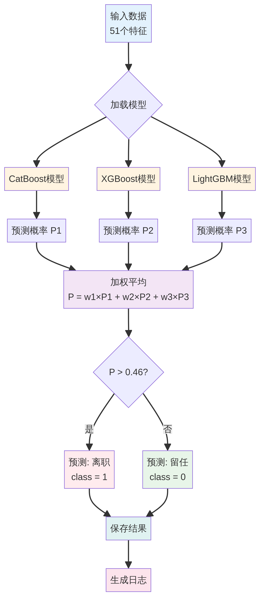
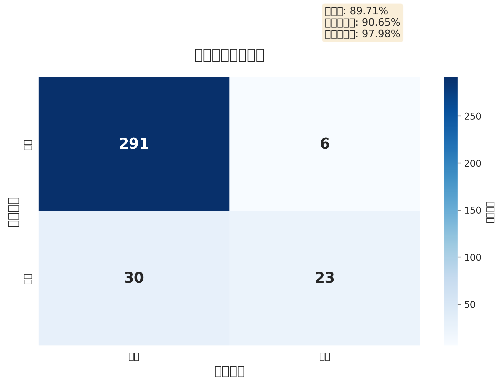
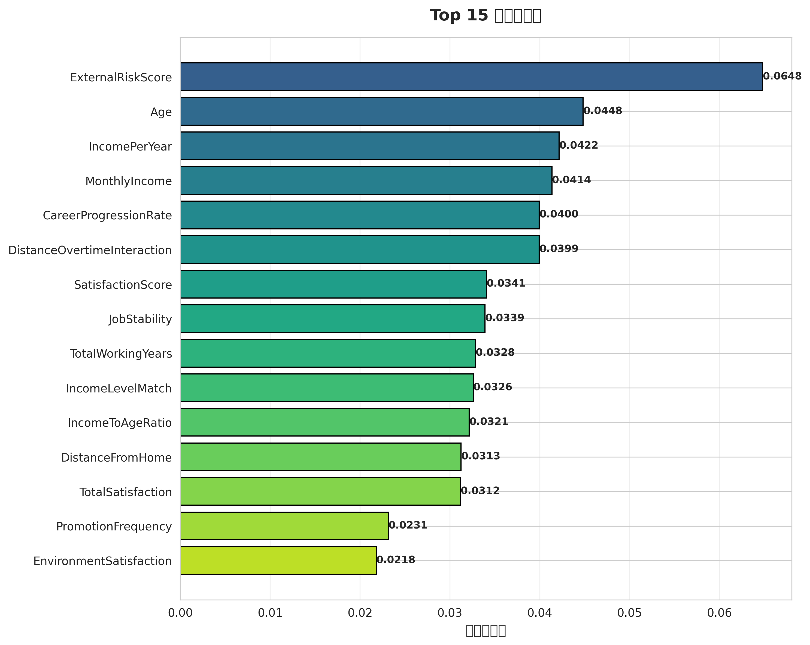
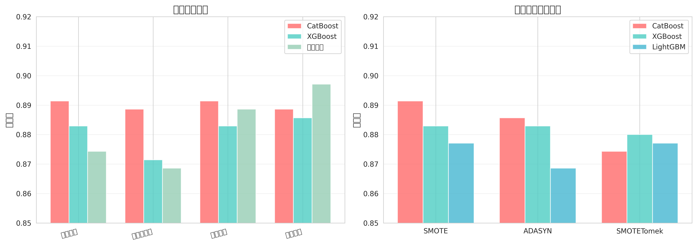
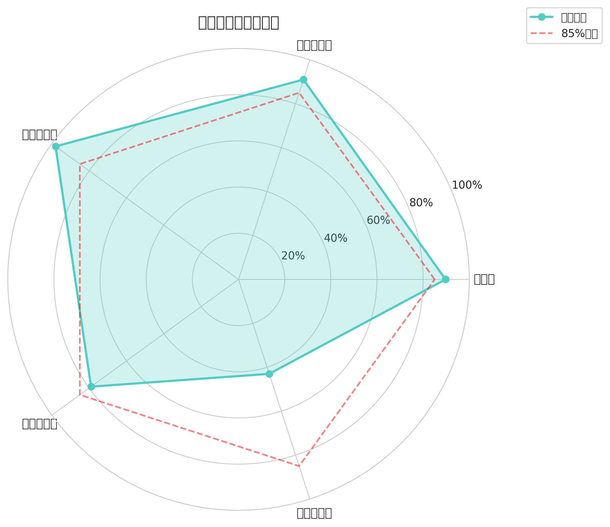

# 项目可视化图表说明

本文件夹包含员工离职预测项目的所有可视化图表。

## 📊 图表清单

### 1. 架构与流程图

#### architecture.png - 项目架构图


**说明**: 展示了整个项目的系统架构，从数据层到输出层的完整流程。

**关键组件**:
- 数据层：原始数据、外部数据、增强数据
- 特征工程层：特征提取、类别编码、数据平衡
- 模型层：CatBoost、XGBoost、LightGBM
- 集成层：加权软投票、阈值优化
- 输出层：预测结果、日志系统、模型文件

---

#### workflow.png - 工作流程图


**说明**: 展示了项目的5个主要阶段及其关键步骤。

**阶段**:
1. 数据探索：加载、分析、可视化
2. 数据增强：收集外部数据、整合、创建新特征
3. 特征工程：移除无用特征、创建衍生特征、编码
4. 模型训练：SMOTE平衡、训练多模型、超参数优化、集成学习
5. 模型部署：保存模型、测试验证、推送GitHub

---

#### prediction_flow.png - 预测流程图


**说明**: 展示了使用集成模型进行预测的详细流程。

**流程**:
1. 输入51个特征
2. 加载3个模型（CatBoost、XGBoost、LightGBM）
3. 每个模型生成预测概率
4. 加权平均：P = w1×P1 + w2×P2 + w3×P3
5. 阈值判断：P > 0.46 → 离职，否则 → 留任
6. 保存结果和生成日志

---

### 2. 性能分析图

#### model_comparison.png - 模型性能对比


**说明**: 对比各个模型在测试集上的准确率。

**结果**:
- CatBoost: 88.86%
- XGBoost: 88.57%
- LightGBM: 88.86%
- **集成模型: 89.71%** ✨

**结论**: 集成模型通过加权软投票，性能优于任何单一模型。

---

#### confusion_matrix.png - 混淆矩阵热图


**说明**: 展示集成模型的预测结果与实际结果的对比。

**矩阵解读**:
- 真负例 (TN): 291 - 正确预测为留任
- 假正例 (FP): 6 - 错误预测为离职
- 假负例 (FN): 30 - 错误预测为留任
- 真正例 (TP): 23 - 正确预测为离职

**性能指标**:
- 准确率: 89.71%
- 留任精确率: 91%
- 留任召回率: 98%

---

#### feature_importance.png - 特征重要性


**说明**: 展示Top 15最重要的特征及其重要性得分。

**Top 5特征**:
1. ExternalRiskScore（外部风险评分）- 6.48%
2. Age（年龄）- 4.48%
3. IncomePerYear（年收入）- 4.22%
4. MonthlyIncome（月收入）- 4.14%
5. CareerProgressionRate（职业发展速度）- 4.00%

**洞察**: 外部数据特征（ExternalRiskScore）成为最重要的预测因子，证明了引入外部数据的有效性。

---

#### optimization_process.png - 优化过程


**说明**: 展示模型在不同优化阶段的性能变化，以及不同采样策略的对比。

**左图 - 模型优化过程**:
- 基准模型 → 超参数优化 → 高级集成 → 最终优化
- 集成模型在最终优化阶段达到最佳性能

**右图 - 采样策略对比**:
- SMOTE、ADASYN、SMOTETomek三种策略
- SMOTE在大多数模型上表现最佳

---

#### data_distribution.png - 数据分布


**说明**: 展示数据集的各种分布情况。

**四个子图**:
1. **数据集划分**: 训练集60.7%、验证集15.2%、测试集24.1%
2. **训练集类别分布**: 留任83.8%、离职16.2%（严重不平衡）
3. **SMOTE数据平衡**: 平衡后留任和离职各50%
4. **特征工程进展**: 从31个原始特征增加到51个最终特征

---

#### performance_radar.png - 性能指标雷达图


**说明**: 以雷达图形式展示集成模型的多维性能指标。

**指标**:
- 准确率: 89.71%
- 留任精确率: 91%
- 留任召回率: 98% ⭐
- 离职精确率: 79%
- 离职召回率: 43%

**分析**: 
- 留任预测表现优秀（召回率98%）
- 离职预测召回率较低，这是类别不平衡的常见问题
- 整体性能超过85%基准线

---

## 📈 图表使用说明

### 在文档中引用

在Markdown文档中引用这些图表：

```markdown

```

### 在演示中使用

所有图表都是高分辨率（300 DPI），适合用于：
- 技术报告
- 学术论文
- 项目演示
- 文档说明

### 重新生成图表

如果需要重新生成图表，运行：

```bash
cd ml_project
python3.11 generate_charts.py
```

## 🎨 图表设计说明

### 配色方案

- **CatBoost**: #FF6B6B（红色）
- **XGBoost**: #4ECDC4（青色）
- **LightGBM**: #45B7D1（蓝色）
- **集成模型**: #96CEB4（绿色）

### 字体设置

- 中文字体：Noto Sans CJK SC / SimHei
- 英文字体：DejaVu Sans
- 标题字体大小：14-16pt
- 正文字体大小：10-12pt

### 图表尺寸

- 单图：8-12英寸宽
- 多子图：12-14英寸宽
- DPI：300（高清晰度）

## 📝 更新日志

- **2025-11-07**: 初始版本，创建9张可视化图表
  - 3张流程图（架构、工作流、预测流程）
  - 6张数据图表（性能对比、混淆矩阵、特征重要性、优化过程、数据分布、雷达图）

---

**生成时间**: 2025年11月7日  
**项目**: 员工离职预测系统  
**版本**: 1.0
